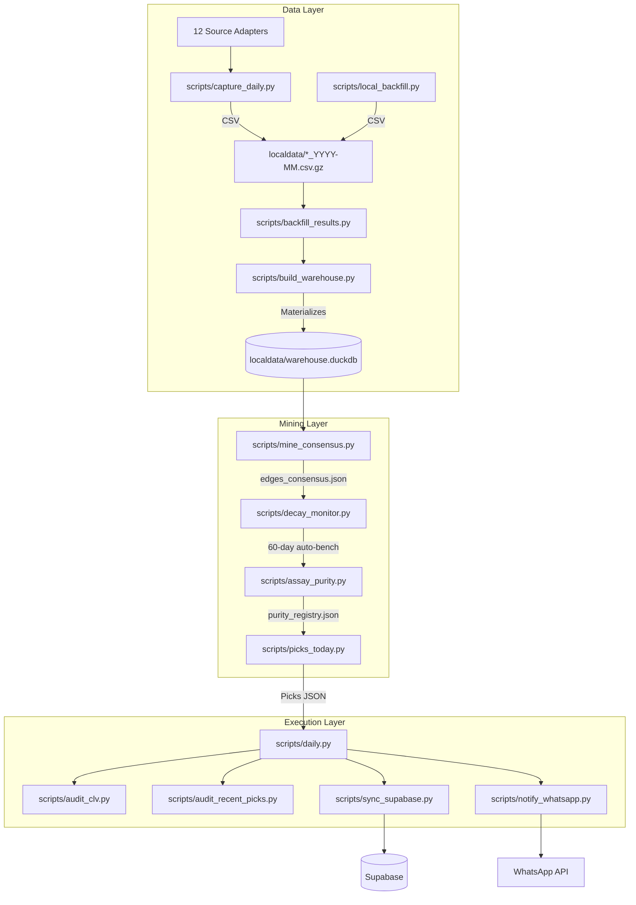

# Edge Factory — Architecture & Data Flow Trace

## Mermaid Architecture Flowchart

## Script & Component Trace Table

| Script / Component | Inputs | Outputs | Critical Functions | Known Bugs & Deviations |
|---|---|---|---|---|
| `capture_daily.py` | 12 Source Adapters | CSVs | Fetches D30 picks from core, partial, shadow sources. | None |
| Source Adapters (`src/edgefactory/sources/*.py`) | None | list[dict] | 12 sources. Core: `forebet`, `zulubet`, `statarea`, `bettingclosed`. Partial: `vitibet`, `scoutingstats`, `betclan`, `bzzoiro`. Shadow: `predictz`, `windrawwin`. Not Ready: `freesupertips`. | None |
| `backfill_results.py` | CSVs | CSVs | Repairs missing `hs`/`gs` from donor result sources. | None |
| `build_warehouse.py` | CSVs | `warehouse.duckdb` | Creates DuckDB views with `sport='soccer'` tag. | None |
| `entities.py` / `build_entity_registry.py` | DB / Overrides | `entity_registry.json` | `canonical_league()`, `canonical_team()` context & reporting. | Must NOT be used for miner joins. |
| `mine_consensus.py` | `warehouse.duckdb` | `edges_consensus.json` | Walk-forward miner. Extracts gates: `min_n_train`, `min_n_valid`, `split`. | None |
| `decay_monitor.py` | `edges_consensus.json` | `edges_consensus.json` | 60-day window health audit (`HEALTHY`, `WATCH`, `DECAYING`, `DEAD`). | Auto-bench trigger. |
| `assay_purity.py` | `warehouse.duckdb` | `purity_registry.json` | Assay purity. Niche context shape: `sport|league|market|rule|odds_band|side_role`. | None |
| `picks_today.py` | `purity_registry.json`, `edges` | `picks_today.json` | Bucket order: `CERTIFIED_CLEAN` -> `CAUTION` -> `WATCHLIST_NO_ODDS` -> `WATCHLIST_UNKNOWN_CTX` -> `SKIPPED_VETO` -> `SKIPPED_DEAD_EDGE`. | Sniper gate <1.25, away-fav <1.30 veto, 30m guard. |
| `audit_clv.py` / `clv.py` | `picks` | `clv_report_rolling.json` | Captures `pick_time` & `end_of_run`. IP conversion. | Fallback matching fragility. |
| `sync_supabase.py` / `db.py` | `edges`, `picks` | Supabase DB | Push to read model using `SUPABASE_SERVICE_KEY`. | None |
| `notify_whatsapp.py` / `whatsapp.py` | `picks_today.json` | WhatsApp Push | Dispatches alerts for CLEAN/CAUTION buckets. | `whatsapp.py` vs `whatsapp.php` BUG_OPEN_2026-06-18. |
| `daily.py` (Orchestrator) | ALL | ALL | Maps full run order. `--auto-run` / `--auto-once` branches. | None |

## Pick Execution Policies (picks_today.py)

- **Bucket Assignment Order:** `CERTIFIED_CLEAN` -> `CAUTION` -> `WATCHLIST_NO_ODDS` -> `WATCHLIST_UNKNOWN_CTX` -> `SKIPPED_VETO` -> `SKIPPED_DEAD_EDGE`
- **Short-Odds Sniper Gate:** Raw 1X2 picks at `odds >= 1.25` are vetoed (`BUCKET_SKIP_VETO`).
- **Away-Favorite Veto:** Raw 1X2 away selections at `odds < 1.30` are vetoed.
- **Duplicate Collapse Logic:** Final pick output strips common tokens (`AC`, `FC`, `SC`, etc.) using `OPERATIONAL_CLUB_TOKENS` logic while preserving identity-bearing suffixes (`W`, `U19`, `B`).
- **Pre-match Guard:** Ensures picks are generated at least 30 minutes before kickoff (`min_lead_minutes = 30`), dropping any already started or missing kickoff data.

## Identified Deviations & Bugs

- **WhatsApp Endpoint Bug:** `src/edgefactory/whatsapp.py:237` currently attempts to use `whatsapp.php` (if fixed) or `whatsapp.py` (if bugged) — flagged as `BUG_OPEN_2026-06-18`. Also, `run_soft` swallows delivery failures leading to false green CI.
- **Supabase Credentials:** Code safely utilizes `SUPABASE_SERVICE_KEY`, confirming `SUPABASE_KEY` is completely ignored.
